# minecraft-resource-emoji

## License

* The emoji images in this project are used from [Twemoji](https://twemoji.twitter.com/) which are licensed by [CC BY 4.0](https://creativecommons.org/licenses/by/4.0/).
* Code licensed under the GPL-3.0

## Screenshots

 

## custom unicode code

| emoji name | emoji id | **assets** |  str  |  img  |
| :--------: | :------: | :--------: | :---: | :---: |
|`emoji_4`|`962909739614867527`|`\uf000`|``||
|`emoji_5`|`963364509064527873`|`\uf001`|``||
|`emoji_6`|`963364525279707186`|`\uf002`|``||
|`emoji_6`|`963364559689769021`|`\uf003`|``||
|`emoji_7`|`963364574202040331`|`\uf004`|``||
|`emoji_12`|`971729144624844800`|`\uf005`|``||
|`emoji_13`|`971729189973680188`|`\uf006`|``||
|`emoji_14`|`971729261075521627`|`\uf007`|``||
|`emoji_15`|`971729297448501340`|`\uf008`|``||
|`865409736539373568`|`978228397501202493`|`\uf009`|``||
|`emoji_11`|`998519231110979634`|`\uf00a`|``||
|`emoji_12`|`998519245719732315`|`\uf00b`|``||
|`emoji_13`|`998570935768592404`|`\uf00c`|``||
|`emoji_14`|`999005190051074059`|`\uf00d`|``||
|`emoji_15`|`999957143677571072`|`\uf00e`|``||
|`emoji_16`|`1000047447894134854`|`\uf00f`|``||
|`emoji_17`|`1000664830442741760`|`\uf010`|``||
|`emoji_18`|`1001183372829266031`|`\uf011`|``||
|`emoji_20`|`1001183529901772870`|`\uf012`|``||
|`emoji_20`|`1001183737603702875`|`\uf013`|``||
|`emoji_21`|`1001183934870204497`|`\uf014`|``||
|`emoji_22`|`1001441802689200188`|`\uf015`|``||
|`emoji_23`|`1002483606519808052`|`\uf016`|``||
|`emoji_24`|`1002541578491002900`|`\uf017`|``||
|`emoji_25`|`1002541787782586458`|`\uf018`|``||
|`emoji_26`|`1002623954730618891`|`\uf019`|``||
|`emoji_27`|`1003205419902193734`|`\uf01a`|``||
|`mc_observer_front`|`1008295036942811156`|`\uf01b`|``||
|`mc_activator_rail_on`|`1008295599474479146`|`\uf01c`|``|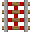|
|`mc_carved_pumpkin`|`1008295600653074435`|`\uf01d`|``||
|`mc_daylight_detector_top`|`1008295602259513365`|`\uf01e`|``||
|`mc_dispenser_front`|`1008295603740098614`|`\uf01f`|``||
|`mc_dropper_front`|`1008295605665267774`|`\uf020`|``||
|`mc_powered_rail_on`|`1008295606835490838`|`\uf021`|``|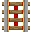|
|`mc_redstone_block`|`1008295608655818783`|`\uf022`|``||
|`mc_redstone_lamp_on`|`1008295610182545418`|`\uf023`|``||
|`mc_tnt_side`|`1008295611654742116`|`\uf024`|``||
|`mc_acacia_boat`|`1008296579301646397`|`\uf025`|``||
|`mc_armor_stand`|`1008296581096800327`|`\uf026`|``|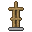|
|`mc_barrier`|`1008296582594179092`|`\uf027`|``||
|`mc_bow_pulling_2`|`1008296584099938364`|`\uf028`|``|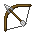|
|`mc_cake`|`1008296585781854258`|`\uf029`|``||
|`mc_diamond`|`1008296587505704960`|`\uf02a`|``||
|`mc_netherite_pickaxe`|`1008296589086965810`|`\uf02b`|``|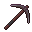|
|`mc_netherite_scrap`|`1008296590538178600`|`\uf02c`|``|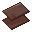|
|`mc_totem_of_undying`|`1008296592140415028`|`\uf02d`|``||
|`mc_wooden_axe`|`1008296593335795813`|`\uf02e`|``||
|`mc_ancient_debris_side`|`1008296994294476850`|`\uf02f`|``||
|`mc_bedrock`|`1008296996009947147`|`\uf030`|``||
|`emoji_50`|`1008667200304988240`|`\uf031`|``||
|`7fa98cafb347d144ef0b5176aadb9c4c`|`1010192333880438884`|`\uf032`|``||
|`mc_command_block_1`|`1010557746334150717`|`\uf033`|``||
|`mc_observer`|`1010558803223269437`|`\uf034`|``||
|`mc_piston`|`1010558807283347536`|`\uf035`|``|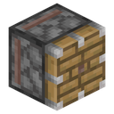|
|`mc_redstone_block`|`1010558809472778340`|`\uf036`|``|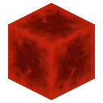|
|`mc_sticky_piston`|`1010558813549629460`|`\uf037`|``|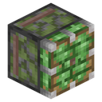|
|`mc_cactus`|`1010564434734886963`|`\uf038`|``|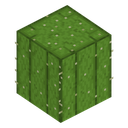|
|`mc_chain_command_block`|`1010564438719471707`|`\uf039`|``|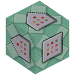|
|`mc_repeating_command_block`|`1010564442284621945`|`\uf03a`|``|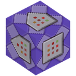|
|`mc_tnt`|`1010564445912694875`|`\uf03b`|``|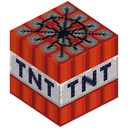|
|`mc_endermite`|`1010574713782800394`|`\uf03c`|``|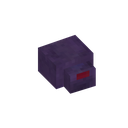|
|`mc_shulker_bullet`|`1010574715947077693`|`\uf03d`|``||
|`mc_wither`|`1010574719474470972`|`\uf03e`|``|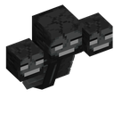|
|`mc_ender_dragon`|`1010595961543864491`|`\uf03f`|``|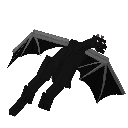|
|`mc_tnt`|`1010595965004173322`|`\uf040`|``||
|`mc_wither_skull`|`1010595968451874937`|`\uf041`|``||
|`mc_dispenser`|`1010596106176036886`|`\uf042`|``|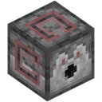|
|`mc_dropper_1`|`1010596110311628841`|`\uf043`|``|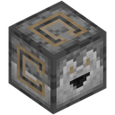|
|`mc_honey_block`|`1010596113998430289`|`\uf044`|``|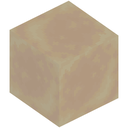|
|`mc_note_block`|`1010596117760720916`|`\uf045`|``|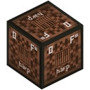|
|`mc_redstone_lamp`|`1010596121330061312`|`\uf046`|``||
|`mc_slime_block`|`1010596124836515910`|`\uf047`|``|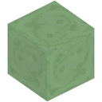|
|`mc_target`|`1010596128426823710`|`\uf048`|``|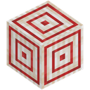|
|`mc_composter`|`1010597754260701236`|`\uf049`|``|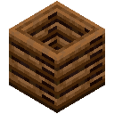|
|`mc_enchanting_table`|`1010597758593421364`|`\uf04a`|``|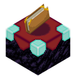|
|`mc_end_portal`|`1010597761038700574`|`\uf04b`|``|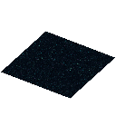|
|`mc_furnace`|`1010597764834525334`|`\uf04c`|``|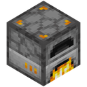|
|`mc_nether_portal`|`1010597768957534239`|`\uf04d`|``|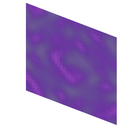|
|`mc_water_cauldron`|`1010597772430426233`|`\uf04e`|``|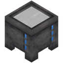|
|`mc_chicken`|`1010597823651258459`|`\uf04f`|``|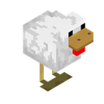|
|`mc_creeper`|`1010597827283517440`|`\uf050`|``|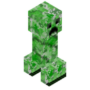|
|`mc_dolphin`|`1010597830701879377`|`\uf051`|``|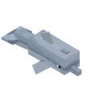|
|`mc_end_crystal`|`1010597832719335496`|`\uf052`|``|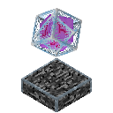|
|`mc_ender_dragon`|`1010597834787135549`|`\uf053`|``||
|`mc_pig`|`1010597838465544358`|`\uf054`|``|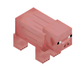|
|`mc_trader_llama`|`1010597840705306664`|`\uf055`|``|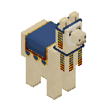|
|`mc_zombie`|`1010597844253687908`|`\uf056`|``|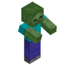|
|`mc_slime`|`1010598076446158879`|`\uf057`|``|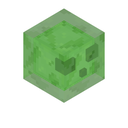|
|`bonk_89`|`1012276396472672317`|`\uf000`|``||
|`emoji_90`|`1012643111463292979`|`\uf001`|``|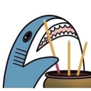|
|`0J0SGFADO_LT7XBO7`|`1013436448906694687`|`\uf002`|``||
|`emoji_92`|`1014212458107379762`|`\uf003`|``||
|`emoji_93`|`1014212481847132261`|`\uf004`|``||
|`emoji_94`|`1014703091213418556`|`\uf005`|``||
|`emoji_95`|`1014703107973845053`|`\uf006`|``||
|`emoji_95`|`1014705152122429511`|`\uf007`|``||
|`emoji_96`|`1014705174205448322`|`\uf008`|``||
|`mc_comparator_1`|`1015122205308358656`|`\uf009`|``|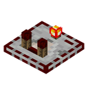|
|`mc_repeater`|`1015122208928051301`|`\uf00a`|``|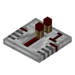|
|`emoji_102`|`1017657604698275860`|`\uf00b`|``||
|`emoji_103`|`1017657625778855947`|`\uf00c`|``||
|`emoji_104`|`1018026102435880960`|`\uf00d`|``||
|`emoji_105`|`1018411448294191125`|`\uf00e`|``||
|`emoji_106`|`1019204925093322822`|`\uf00f`|``||
|`emoji_107`|`1020480666091147305`|`\uf010`|``||
|`emoji_98`|`1021098916529320076`|`\uf011`|``||
|`punch_01`|`1021099654001205349`|`\uf012`|``|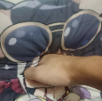|
|`IMG_8811`|`1022531118119002123`|`\uf013`|``||
|`898957552732225566`|`1022531120476209272`|`\uf014`|``||
|`IMG_8809`|`1022531123449970698`|`\uf015`|``||
|`IMG_8788`|`1022531126201426050`|`\uf016`|``||
|`emoji_114`|`1022694974762012672`|`\uf017`|``||
|`emoji_110`|`1023162013049966674`|`\uf018`|``||
|`emoji_111`|`1024501079624384572`|`\uf019`|``||
|`emoji_112`|`1027862209327542272`|`\uf01a`|``||
|`bonk_89s`|`1029785067649781824`|`\uf01b`|``||
|`bonk_89p`|`1029785701799186593`|`\uf01c`|``||
|`mc_diamond_block`|`1029786726740263012`|`\uf01d`|``||
|`mc_gold_block`|`1029786730506768394`|`\uf01e`|``||
|`mc_hopper`|`1029786734160007259`|`\uf01f`|``|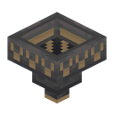|
|`mc_iron_block`|`1029786738190716948`|`\uf020`|``|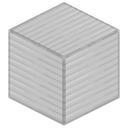|
|`mc_shulker_box`|`1029786743618142369`|`\uf021`|``|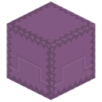|
|`mc_smooth_stone`|`1029786745539153922`|`\uf022`|``|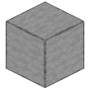|
|`mc_chest`|`1029787455391551630`|`\uf023`|``|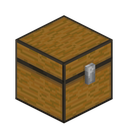|
|`mc_ender_chest`|`1029787459191570482`|`\uf024`|``|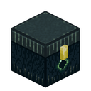|
|`mc_target_1`|`1029787463260053564`|`\uf025`|``||
|`mc_anvil`|`1029787970716307507`|`\uf026`|``|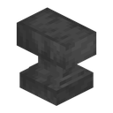|
|`mc_redstone_torch`|`1029788113679175751`|`\uf027`|``|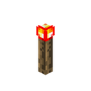|
|`emoji_120`|`1030066467003183175`|`\uf028`|``||
|`faceholdingbacktears`|`1032282507787382867`|`\uf029`|``||
|`faceholdingbacktears_1`|`1032284334608097310`|`\uf02a`|``||
|`emoji_123`|`1032625692682231828`|`\uf02b`|``||
|`emoji_124`|`1032625708859674625`|`\uf02c`|``||
|`emoji_125`|`1033245562859958363`|`\uf000`|``||
