# minecraft-resource-emoji

## License

* The emoji images in this project are used from [Twemoji](https://twemoji.twitter.com/) which are licensed by [CC BY 4.0](https://creativecommons.org/licenses/by/4.0/).
* Code licensed under the GPL-3.0

## Screenshots

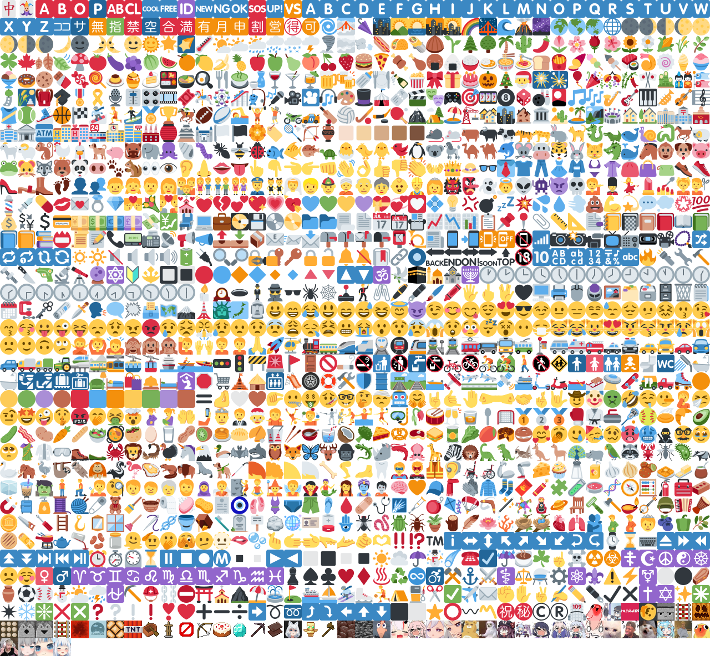

## custom unicode code

|   discord emoji id    | **assets** |  str  |                     img                      |
| :-------------------: | :--------: | :---: | :------------------------------------------: |
| `1000047447894134854` |  `\uf000`  |  ``  |   |
| `1000664830442741760` |  `\uf001`  |  ``  |   |
| `1001183372829266031` |  `\uf002`  |  ``  |   |
| `1001183529901772870` |  `\uf003`  |  ``  |   |
| `1001183737603702875` |  `\uf004`  |  ``  |   |
| `1001183934870204497` |  `\uf005`  |  ``  |   |
| `1001441802689200188` |  `\uf006`  |  ``  |   |
| `1002483606519808052` |  `\uf007`  |  ``  |   |
| `1002541578491002900` |  `\uf008`  |  ``  |   |
| `1002541787782586458` |  `\uf009`  |  ``  |   |
| `1002623954730618891` |  `\uf00a`  |  ``  |  |
| `1003205419902193734` |  `\uf00b`  |  ``  |  |
| `1008295036942811156` |  `\uf00c`  |  ``  | 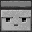 |
| `1008295599474479146` |  `\uf00d`  |  ``  | 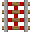 |
| `1008295600653074435` |  `\uf00e`  |  ``  |  |
| `1008295602259513365` |  `\uf00f`  |  ``  |  |
| `1008295603740098614` |  `\uf010`  |  ``  |  |
| `1008295605665267774` |  `\uf011`  |  ``  |  |
| `1008295606835490838` |  `\uf012`  |  ``  | 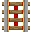 |
| `1008295608655818783` |  `\uf013`  |  ``  | 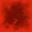 |
| `1008295610182545418` |  `\uf014`  |  ``  |  |
| `1008295611654742116` |  `\uf015`  |  ``  |  |
| `1008296579301646397` |  `\uf016`  |  ``  |  |
| `1008296581096800327` |  `\uf017`  |  ``  | 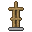 |
| `1008296582594179092` |  `\uf018`  |  ``  |  |
| `1008296584099938364` |  `\uf019`  |  ``  | 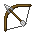 |
| `1008296585781854258` |  `\uf01a`  |  ``  |  |
| `1008296587505704960` |  `\uf01b`  |  ``  |  |
| `1008296589086965810` |  `\uf01c`  |  ``  | 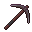 |
| `1008296590538178600` |  `\uf01d`  |  ``  | 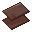 |
| `1008296592140415028` |  `\uf01e`  |  ``  |  |
| `1008296593335795813` |  `\uf01f`  |  ``  | 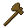 |
| `1008296994294476850` |  `\uf020`  |  ``  |  |
| `1008296996009947147` |  `\uf021`  |  ``  | 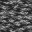 |
| `1008667200304988240` |  `\uf022`  |  ``  |  |
| `1010192333880438884` |  `\uf023`  |  ``  |  |
| `962909739614867527`  |  `\uf024`  |  ``  |  |
| `963364509064527873`  |  `\uf025`  |  ``  |  |
| `963364525279707186`  |  `\uf026`  |  ``  |  |
| `963364559689769021`  |  `\uf027`  |  ``  |  |
| `963364574202040331`  |  `\uf028`  |  ``  |  |
| `971729144624844800`  |  `\uf029`  |  ``  |  |
| `971729189973680188`  |  `\uf02a`  |  ``  |  |
| `971729261075521627`  |  `\uf02b`  |  ``  |  |
| `971729297448501340`  |  `\uf02c`  |  ``  |  |
| `978228397501202493`  |  `\uf02d`  |  ``  |  |
| `998519231110979634`  |  `\uf02e`  |  ``  |  |
| `998519245719732315`  |  `\uf02f`  |  ``  |  |
| `998570935768592404`  |  `\uf030`  |  ``  |  |
| `999005190051074059`  |  `\uf031`  |  ``  |  |
| `999957143677571072`  |  `\uf032`  |  ``  |  |
