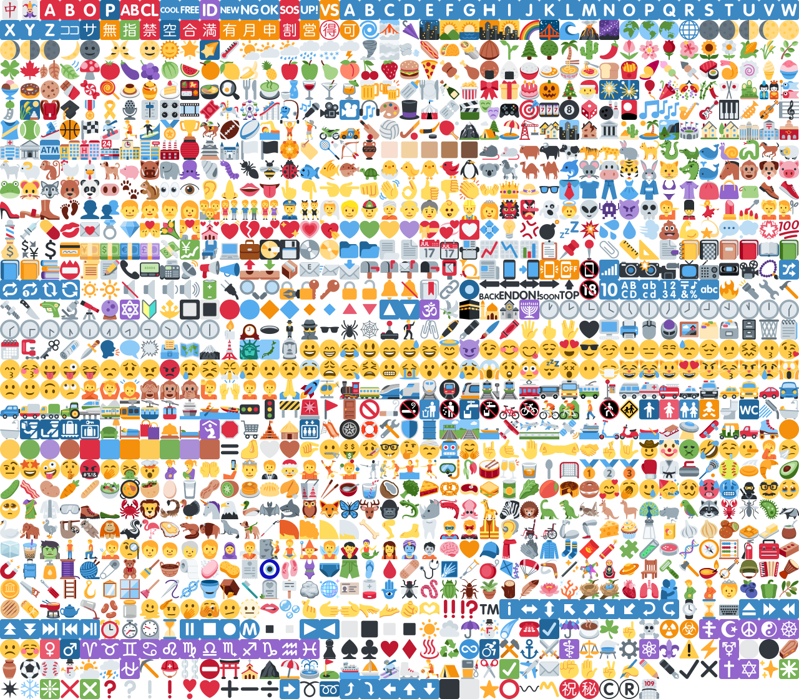
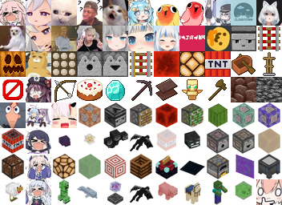

# minecraft-resource-emoji

## License

* The emoji images in this project are used from [Twemoji](https://twemoji.twitter.com/) which are licensed by [CC BY 4.0](https://creativecommons.org/licenses/by/4.0/).
* Code licensed under the GPL-3.0

## Screenshots

 

## custom unicode code

| emoji name | emoji id | **assets** |  str  |  img  |
| :--------: | :------: | :--------: | :---: | :---: |
${{ custom_unicode_insert }}
